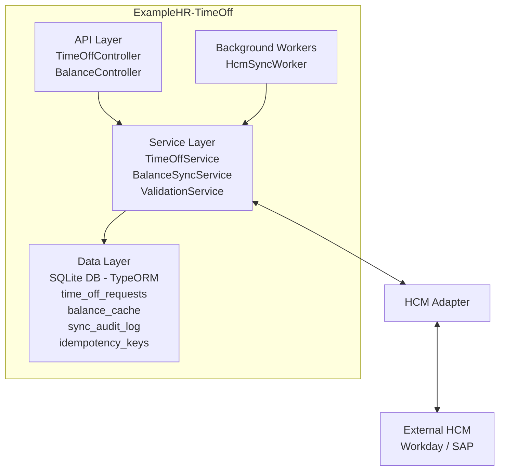

# Technical Requirement Document (TRD) — TimeOff Microservice

| Attribute | Value |
| :--- | :--- |
| **Version** | 1.0.0 |
| **Status** | Draft |
| **Date** | April 2026 |
| **Owner** | Platform Engineering |
| **Stack** | NestJS · SQLite · REST |

---

## 1. Executive Summary

**ExampleHR-TimeOff** is a purpose-built NestJS microservice responsible for the full lifecycle of employee time-off requests within the ExampleHR platform. It acts as an orchestration layer between employee-facing product surfaces and an authoritative external Human Capital Management (HCM) system (Workday or SAP), which is the single source of truth for leave balances.

The service provides a clean REST API surface for submitting, reviewing, approving, and cancelling time-off requests. It maintains a local SQLite cache of balance data for low-latency reads, while continuously reconciling that cache against the HCM via both real-time per-request lookups and nightly batch ingests.

### Key Design Principles
*   **Correctness over availability**: When balance data is ambiguous or stale, the system fails safe.
*   **Defensive validation**: The service enforces business rules even when the HCM fails to reject invalid payloads.
*   **Idempotent mutations**: All state-changing operations are safe to retry.
*   **Auditability**: Every balance mutation and sync event is durably logged.

> [!NOTE]
> **Scope**: This document covers the v1.0 architecture, data model, API surface, sync strategy, and engineering trade-offs. It is intended for platform engineers, security reviewers, and integration partners.

---

## 2. Problem Statement & Challenges

The following engineering challenges were identified during discovery and architecture review:

#### **Challenge 1 — Stale Balance Cache**
External actors (payroll runs, anniversary bonuses, manual HCM adjustments) can modify balances at any time without notifying this service. Our local SQLite cache becomes stale silently. We cannot blindly trust cached values before approving requests that deduct balance.

#### **Challenge 2 — HCM Silent Acceptance of Invalid Writes**
The HCM REST API has been observed to return HTTP 200 for balance-adjust calls even when the requested deduction exceeds the employee's actual available balance (e.g., sub-zero net result). This means we cannot rely on HCM error responses as a balance guardrail. The service must independently enforce non-negative post-deduction balance constraints.

#### **Challenge 3 — Composite Identity for Balances**
Balances are scoped per employee per location (`employeeId` + `locationId`). An employee who transfers locations mid-year accumulates two distinct balance records. All queries, caches, and sync logic must treat the `(employeeId, locationId)` tuple as the unique key, not `employeeId` alone.

#### **Challenge 4 — Dual Sync Surface with Conflict Risk**
The HCM exposes both a real-time REST API (individual reads/writes) and a batch push endpoint (full corpus). The batch payload represents a point-in-time snapshot. A real-time write that succeeded after the batch snapshot was taken will be overwritten unless the ingest logic reconciles correctly. Last-write-wins without timestamp awareness will cause balance regressions.

#### **Challenge 5 — Idempotency and Double-Submission**
Network instability and client retries can cause the same time-off request to be submitted multiple times. Without idempotency controls, this results in duplicate approvals and double deductions. The service must deduplicate at the API boundary using client-supplied idempotency keys.

#### **Challenge 6 — Distributed Approval Race Conditions**
Two managers reviewing the same request concurrently (or a request being cancelled simultaneously with approval) can result in conflicting state transitions. Optimistic locking using a version counter on the request row must guard all state machine transitions.

#### **Challenge 7 — HCM Unavailability Degradation**
The HCM real-time API has a documented SLA of 99.5%, meaning up to 43 hours of downtime annually. The service must gracefully degrade: serving reads from cache with a staleness header, queuing balance writes, and resuming sync on recovery — without losing any approved deductions.

---

## 3. Proposed Solution

### 3.1 Architecture Overview

The following diagram illustrates the high-level component topology:



### 3.2 Module Decomposition

| Module | Responsibility |
| :--- | :--- |
| **TimeOffModule** | Request lifecycle: create, approve, reject, cancel, list |
| **BalanceModule** | Balance read/write/cache; enforces non-negative constraint |
| **HcmAdapterModule** | HTTP client wrapping the HCM REST API; circuit-breaker enabled |
| **SyncModule** | Cron-driven batch ingest; real-time pull scheduler; audit log writes |
| **ValidationModule** | Business rule enforcement independent of HCM response codes |
| **IdempotencyModule** | Stores and checks idempotency keys; TTL-based cleanup |
| **AuditModule** | Append-only audit trail for every state transition and sync event |

### 3.3 Data Model

#### **Table: `time_off_requests`**

| Column | Type | Constraints | Notes |
| :--- | :--- | :--- | :--- |
| `id` | TEXT | PK, UUID v4 | Client-visible identifier |
| `idempotency_key` | TEXT | UNIQUE, NOT NULL | Client-supplied; deduplicate retries |
| `employee_id` | TEXT | NOT NULL, INDEXED | HCM employee identifier |
| `location_id` | TEXT | NOT NULL, INDEXED | Balance scope partition |
| `leave_type` | TEXT | NOT NULL | ANNUAL \| SICK \| PERSONAL \| UNPAID |
| `start_date` | DATE | NOT NULL | ISO 8601 date |
| `end_date` | DATE | NOT NULL | ISO 8601 date; >= start_date |
| `days_requested` | REAL | NOT NULL, > 0 | Computed from calendar |
| `status` | TEXT | NOT NULL | PENDING \| APPROVED \| REJECTED \| CANCELLED |
| `version` | INTEGER | NOT NULL, DEFAULT 1 | Optimistic lock counter |
| `approved_by` | TEXT | NULLABLE | Manager employee_id |
| `rejection_reason` | TEXT | NULLABLE | Free text |
| `hcm_sync_status` | TEXT | NOT NULL | PENDING \| SYNCED \| FAILED |
| `created_at` | DATETIME | NOT NULL | UTC timestamp |
| `updated_at` | DATETIME | NOT NULL | Updated on every write |

#### **Table: `balance_cache`**

| Column | Type | Constraints | Notes |
| :--- | :--- | :--- | :--- |
| `id` | TEXT | PK, UUID v4 | |
| `employee_id` | TEXT | NOT NULL | Composite PK part 1 |
| `location_id` | TEXT | NOT NULL | Composite PK part 2 |
| `leave_type` | TEXT | NOT NULL | |
| `available_days` | REAL | NOT NULL, >= 0 | CHECK constraint enforced in DB |
| `used_days` | REAL | NOT NULL, >= 0 | |
| `pending_days` | REAL | NOT NULL, >= 0 | Sum of PENDING request days |
| `accrued_ytd` | REAL | NOT NULL | Copied from HCM |
| `source` | TEXT | NOT NULL | REALTIME \| BATCH \| LOCAL |
| `synced_at` | DATETIME | NOT NULL | Last successful HCM sync timestamp |
| `hcm_etag` | TEXT | NULLABLE | HCM ETag for conditional GETs |
| `is_stale` | INTEGER | NOT NULL, DEFAULT 0 | 1 if sync is overdue (> staleness_ttl) |

#### **Table: `sync_audit_log`**

| Column | Type | Notes |
| :--- | :--- | :--- |
| `id` | TEXT | UUID v4 |
| `sync_type` | TEXT | REALTIME_READ \| REALTIME_WRITE \| BATCH_INGEST |
| `employee_id` | TEXT | Nullable for batch events |
| `location_id` | TEXT | Nullable for batch events |
| `before_snapshot` | TEXT | JSON blob of balance_cache row before mutation |
| `after_snapshot` | TEXT | JSON blob of balance_cache row after mutation |
| `hcm_response` | TEXT | Raw HCM response (truncated at 4 KB) |
| `conflict_flag` | INTEGER | 1 if batch value differed from local by > threshold |
| `created_at` | DATETIME | UTC |

#### **Table: `idempotency_keys`**

| Column | Type | Notes |
| :--- | :--- | :--- |
| `key` | TEXT | PK — client-supplied UUID |
| `request_hash` | TEXT | SHA-256 of request body; detect payload mismatch |
| `response` | TEXT | Serialised HTTP response to replay on retry |
| `created_at` | DATETIME | Used for TTL eviction (default 24 h) |

---

## 4. API Surface

All endpoints are versioned under `/api/v1`. Auth is via Bearer JWT; role claims (`EMPLOYEE`, `MANAGER`, `ADMIN`) are extracted from token. All mutation endpoints require an `Idempotency-Key` header.

### 4.1 Time-Off Requests

| Method | Path | Role | Description |
| :--- | :--- | :--- | :--- |
| **POST** | `/time-off/requests` | EMPLOYEE | Submit a new time-off request |
| **GET** | `/time-off/requests` | EMPLOYEE/MANAGER | List requests (filterable) |
| **GET** | `/time-off/requests/:id` | EMPLOYEE/MANAGER | Get single request by ID |
| **PATCH** | `/time-off/requests/:id/approve` | MANAGER | Approve a PENDING request |
| **PATCH** | `/time-off/requests/:id/reject` | MANAGER | Reject with reason |
| **DELETE** | `/time-off/requests/:id` | EMPLOYEE | Cancel own PENDING request |

#### **POST /time-off/requests — Request Body**
```json
{
  "idempotencyKey": "uuid-v4",
  "employeeId":     "EMP-001",
  "locationId":     "LOC-NYC",
  "leaveType":      "ANNUAL",
  "startDate":      "2026-08-01",
  "endDate":        "2026-08-05",
  "notes":          "Summer holiday"
}
```

#### **POST /time-off/requests — Response 201**
```json
{
  "id":            "req-uuid",
  "status":        "PENDING",
  "daysRequested": 5,
  "balanceAfter":  12.5,
  "createdAt":     "2026-04-24T09:00:00Z"
}
```

### 4.2 Balance Endpoints

| Method | Path | Role | Description |
| :--- | :--- | :--- | :--- |
| **GET** | `/balances/:employeeId/:locationId` | EMPLOYEE/MANAGER | Read balance (cache + staleness flag) |
| **GET** | `/balances/:employeeId/:locationId/refresh` | MANAGER/ADMIN | Force real-time pull from HCM |
| **POST** | `/balances/batch-ingest` | ADMIN/SYSTEM | Ingest full HCM batch payload |

#### **GET /balances/:employeeId/:locationId — Response 200**
```json
{
  "employeeId":    "EMP-001",
  "locationId":    "LOC-NYC",
  "leaveType":     "ANNUAL",
  "availableDays": 17.5,
  "usedDays":      5.0,
  "pendingDays":   3.0,
  "syncedAt":      "2026-04-24T06:00:00Z",
  "isStale":       false,
  "source":        "REALTIME"
}
```

### 4.3 Sync & Admin Endpoints

| Method | Path | Role | Description |
| :--- | :--- | :--- | :--- |
| **GET** | `/sync/status` | ADMIN | Last sync timestamp, record count, error rate |
| **POST** | `/sync/trigger` | ADMIN | Manually trigger a batch ingest |
| **GET** | `/sync/audit-log` | ADMIN | Paginated audit log (filterable by employee) |
| **GET** | `/health` | PUBLIC | Liveness + HCM connectivity check |
| **GET** | `/metrics` | ADMIN | Prometheus-compatible metrics endpoint |

### 4.4 Error Handling

| HTTP Status | Error Code | Trigger |
| :--- | :--- | :--- |
| **400** | `INVALID_DATE_RANGE` | `end_date < start_date`, or dates in the past |
| **409** | `IDEMPOTENCY_CONFLICT` | Same key, different payload hash |
| **409** | `OPTIMISTIC_LOCK_CONFLICT` | Version mismatch on approve/reject |
| **422** | `INSUFFICIENT_BALANCE` | Defensive check: balance would go negative |
| **422** | `OVERLAPPING_REQUEST` | Approved request exists for same date range |
| **503** | `HCM_UNAVAILABLE` | HCM circuit-breaker open; serving stale data |

---

## 5. Balance Sync Strategy

### 5.1 Real-Time Pull (Per-Request)
Before processing any request that reads or mutates a balance, the service fetches the current balance from the HCM real-time API:
*   `GET /employees/{employeeId}/balances?locationId={locationId}`
*   `If-None-Match: {cached_etag}`

1.  **HCM 200**: Update cache, proceed.
2.  **HCM 304**: Cache hit confirmed; use cached value.
3.  **HCM 5xx/Timeout**: Serve from cache, set `is_stale=true`, attach `X-Balance-Stale: true` header. Block deductions (approvals); allow reads.

### 5.2 Nightly Batch Ingest
At 02:00 UTC, the HCM pushes the full balance corpus to `POST /balances/batch-ingest`.
1.  **Conflict Resolution**: If `hcm_as_of` > `local synced_at`, accept HCM value. Otherwise, retain local and log a conflict.
2.  **Pending Offset**: `available_days_final = hcm_available - sum(PENDING request days)`.
3.  **Audit**: Emit `sync_audit_log` for every row.

> [!CAUTION]
> **Conflict Threshold Alert**: If >5% of batch rows raise a conflict, an alert is fired and the batch is quarantined for manual review.

### 5.3 Defensive Balance Validation
The service enforces the following check before any approval:
`effectiveAvailable = hcm_available_days - sum(APPROVED requests overlapping) - sum(PENDING requests)`
If `(effectiveAvailable - daysRequested) < 0`, throw `InsufficientBalanceException`.

---

## 6. Error Handling & Edge Cases

### 6.1 Edge Cases Matrix

| Scenario | Detection | Mitigation |
| :--- | :--- | :--- |
| **Sync in progress** | `balance_cache.is_stale = true` | Block approval; return 503 |
| **Approve cancelled req** | `status != PENDING` | Return 409 with current status |
| **Malformed HCM JSON** | `JSON.parse` throws | Fallback to cache; log error; set `is_stale` |
| **Location transfer** | `location_id` mismatch | Treat as new balance key; old req cancelled |
| **Unknown employeeId** | Missing row in `balance_cache` | UPSERT new row; log as new employee sync |
| **Duplicate batch** | `hcm_as_of` timestamp identical | Idempotent upsert; skip audit log |
| **Circuit breaker open** | `CircuitOpenException` | Halt approval; return 503 |
| **Manager race** | Version mismatch on PATCH | Return 409 `OPTIMISTIC_LOCK_CONFLICT` |

### 6.2 Circuit Breaker Configuration

| Parameter | Value | Notes |
| :--- | :--- | :--- |
| **Failure threshold** | 5 failures | Consecutive failures to open circuit |
| **Success threshold** | 2 successes | Required to close from half-open |
| **Open duration** | 60 seconds | Before moving to half-open |
| **Timeout per call** | 5 seconds | Abort and count as failure |
| **Max retry attempts** | 5 | Then mark as FAILED permanently |

---

## 7. Alternatives Considered

*   **Alternative A: No Local Cache** — Rejected due to high latency (~200–800ms per HCM roundtrip) and total unavailability when HCM is down.
*   **Alternative B: Event-Driven Sync** — Deferred to v2. Significant operational overhead (Kafka/SQS) for v1, and dependency on vendor webhook support.
*   **Alternative C: PostgreSQL** — Decision: SQLite is sufficient for v1 load (<500 concurrent employees). Migration to Postgres remains easy via TypeORM.

---

## 8. Out of Scope

*   Calendar integration for public-holiday-aware day counting.
*   Multi-step approval workflows or delegation chains.
*   Email/Push notification delivery (handled by Notification Service).
*   Fractional days beyond 0.5 granularity.

---

## 9. Open Questions

| # | Question | Owner | Target Date |
| :--- | :--- | :--- | :--- |
| 1 | Max batch payload size and record count? | HCM Team | 2026-05-01 |
| 2 | Does HCM adjust support idempotency keys? | HCM Team | 2026-05-01 |
| 3 | Agreement on staleness TTL (Proposed: 4h)? | Product | 2026-05-08 |
| 4 | Optimistic vs Conservative deduction? | Product | 2026-05-08 |
| 5 | Expose balance history to employees? | Product | 2026-05-15 |

---

*Document prepared by Platform Engineering | Version 1.0 | April 2026*
